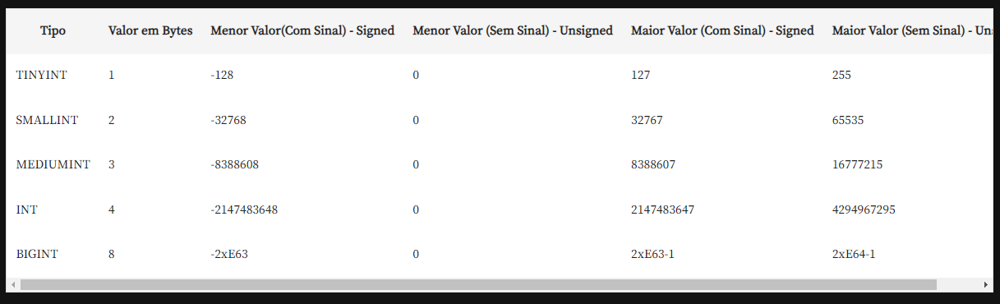

## Curso Mysql

*Comando para a criação de um DATABASE*

````
CREATE {DATABASE | SCHEMA} [IF NOT EXISTS] db_name
      [create_specification]

   create_specification:
            [DEFAULT] CHARACTER SET [=] charset_name
            [DEFAULT] COLLATE [=] collation_name
            DEFAULT ENCRYPTION [=] { 'Y' | 'N'}

````

## Comando para exclusão de tabela

````
DROP {DATABASE | SCHEMA} [IF EXISTS] db_name

````

1. Esse comando seleciona a tabela que deseja apagar e verifica se ela existe ou não.


## Tipos de dados





**Data e Hora**

1. DATE:  armazena um dia, no formato ano, mês e dia com traços entre eles, vai dia 1000-01-01 até 9999-12-31.
2. DATETIME: guarda data e hora. A hora é importante principalmente quando tempos campos do tipo LOG, que possui o horário em que alguém fez alguma ação específica no sistema.
3. TIMESTAMP: é bem semelhante ao o DATETIME, contudo possui duas características principais: tem um range menor, que vai de 1970-01-01 a 2038-01-19 e possui fuso horário. Por isso o range fica menor, para armazenar mais informações. Por mais que esse range de datas pareça pequeno, vale lembrar que utilizamos fuso horário para sistemas, por exemplo, de agendas para marcar reuniões em empresas que tiver funcionários(as) em diversos países. Por isso, o range até 2038 não é tão pequeno quanto parece, visto que ninguém irá marcar uma reunião de hoje até o ano de 2038.
4. TIME: armazena somente o horário e tem um range, de -838:59:59 a 839:59:59. Normalmente, usamos só para gravar uma hora no relógio que vai de meia-noite às onze e cinquenta e nove da noite do dia seguinte. Por isso, não é preciso ter 838 horas gravadas.
5. YEARS: é guardado somente o ano de 1901 a 2155. Podendo ser de duas ou quatro casas decimais, mas, normalmente utilizamos o DATE com uma data de primeiro de janeiro do ano que quero armazenar. 

## Tipos Strings

1. CHAR: Caso tivermos um campo CHAR(4) e o utilizamos para armazenar as letras "aa", no banco de dados será guardado dois espaços vazios, já que no campo foi estabelecido o caractere de tamanho quatro, ficaria " aa". Isto é, esse campo ocupa maior espaço em disco, visto que grava os espaços vazios que, em algumas situações, pode ser desnecessário.

2. VARCHAR: quando nos referimos ao VARCHAR(4), se quisermos armazenar "aa", será guardado somente dois caracteres sem gastar espaço a mais no disco.

## Comando para a criação de tabelas no banco de dados

````
CREATE TABLE tbCliente
(CPF VARCHAR(11),
NOME VARCHAR(100),
ENDERECO1 VARCHAR(150),
ENDERECO2 VARCHAR(150),
BAIRRO VARCHAR(50),
CIDADE VARCHAR(50),
ESTADO VARCHAR(50),
CEP VARCHAR(8),
IDADE SMALLINT,
SEXO VARCHAR(1),
LIMITE_CREDITO FLOAT,
VOLUME_COMPRA FLOAT,
PRIMEIRA_COMPRA BIT(1))

````


